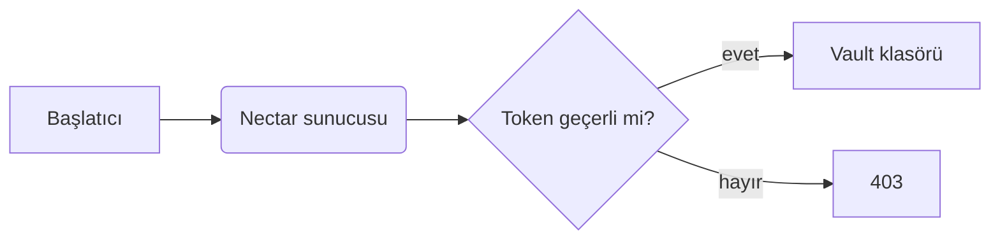
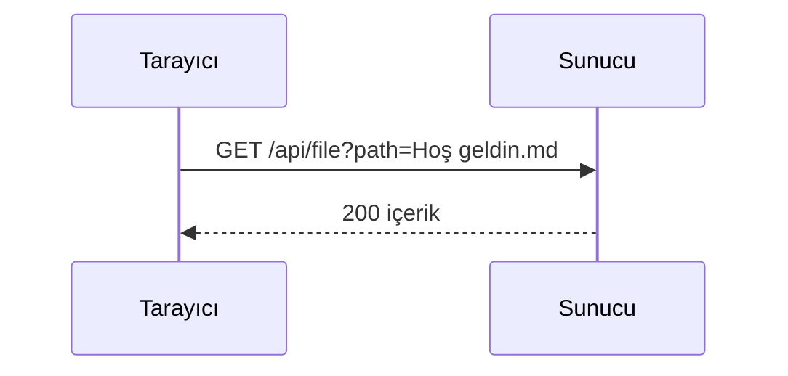
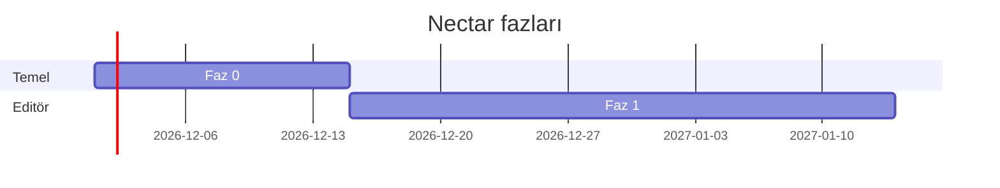
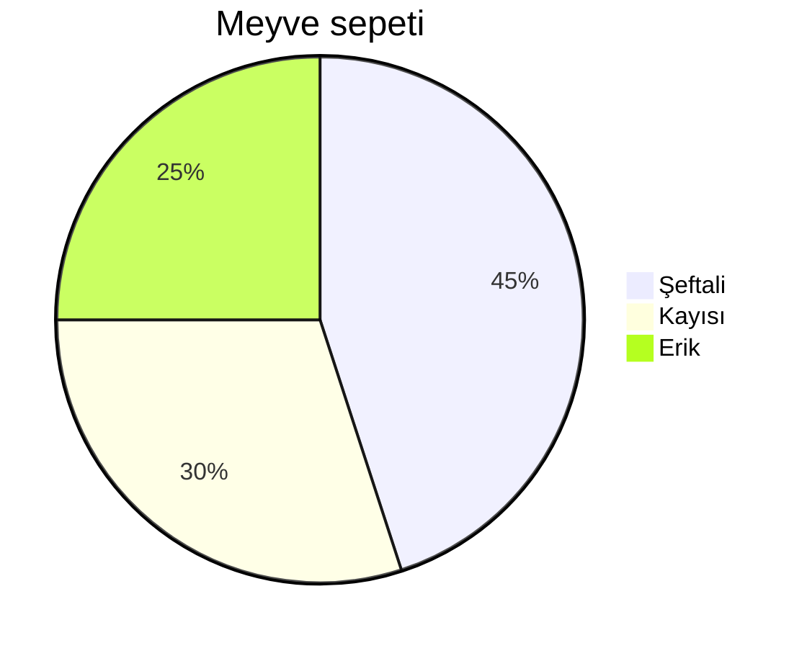

# Mermaid diyagramları

```mermaid
flowchart LR
    A[Başlatıcı] --> B(Nectar sunucusu)
    B --> C{Token geçerli mi?}
    C -->|evet| D[Vault klasörü]
    C -->|hayır| E[403]
```

```mermaid
sequenceDiagram
    participant T as Tarayıcı
    participant S as Sunucu
    T->>S: GET /api/file?path=Hoş geldin.md
    S-->>T: 200 içerik
```

```mermaid
gantt
    title Nectar fazları
    dateFormat YYYY-MM-DD
    section Temel
    Faz 0 :a1, 2026-12-01, 14d
    section Editör
    Faz 1 :after a1, 30d
```

```mermaid
pie title Meyve sepeti
    "Şeftali" : 45
    "Kayısı" : 30
    "Erik" : 25
```
